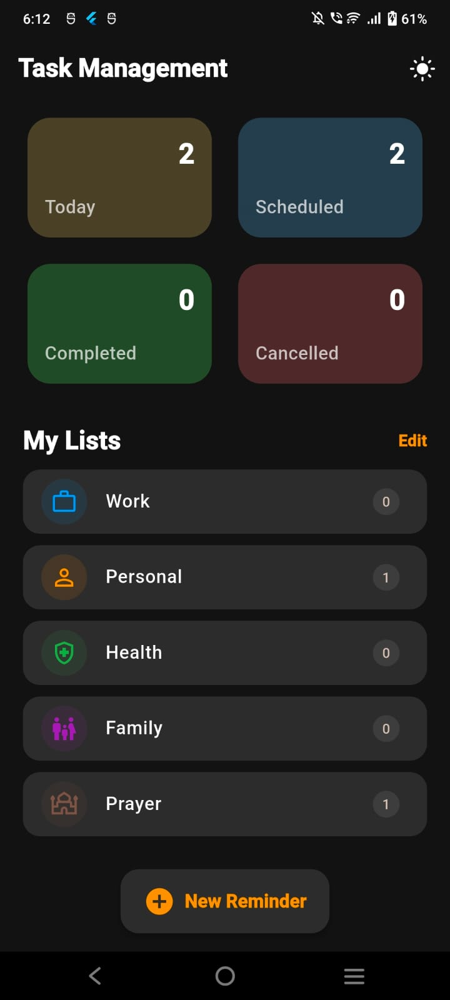
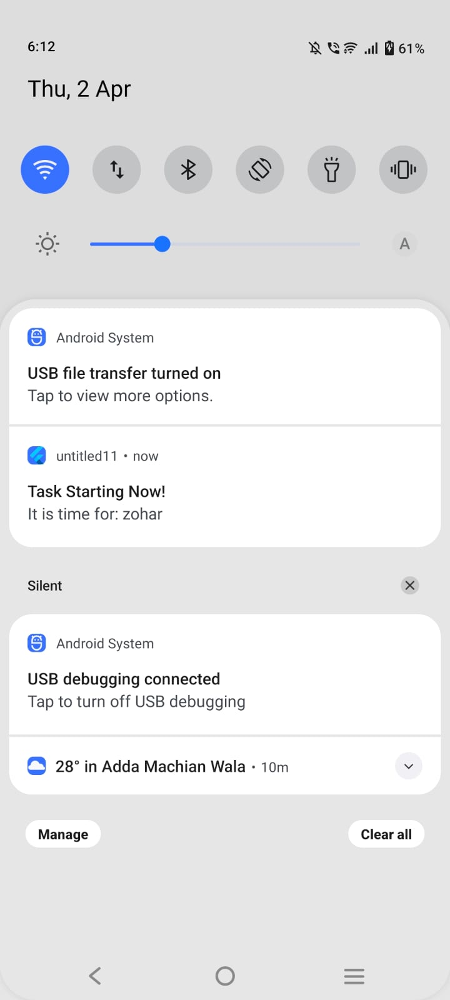
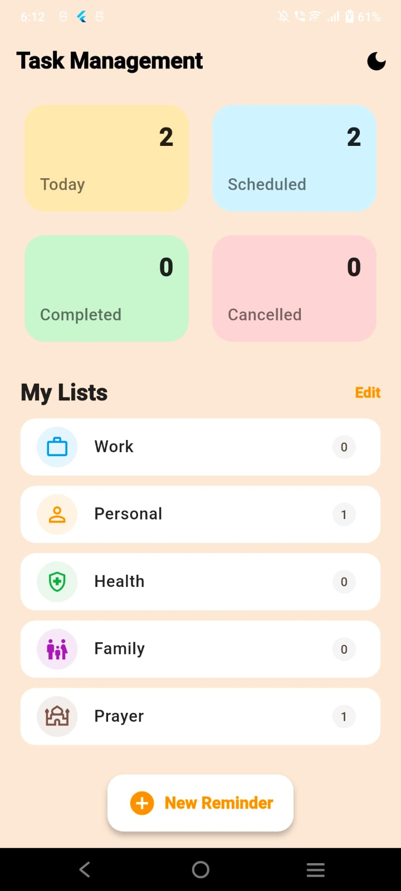

# Task Reminder App

A modern and intuitive Flutter application designed to help users manage their daily tasks efficiently with reminders and notifications.

## 📱 Features

- **Task Management**: Create, edit, and delete tasks with ease
- **Smart Reminders**: Set custom reminders for each task
- **Persistent Storage**: Tasks are saved locally on your device
- **User-Friendly Interface**: Clean and intuitive design for seamless navigation
- **Cross-Platform**: Built with Flutter for iOS and Android compatibility
- **Real-Time Updates**: Instant synchronization of task changes

## 🎯 Screenshots

### Main Interface


### Task Creation


### Reminder Settings


## 🛠 Tech Stack

- **Language**: Dart (95.9%)
- **Framework**: Flutter
- **Platform**: iOS, Android, Web
- **Additional**: Swift (1.4%), HTML (2.4%)

## 📋 Project Structure

```
task-remainder-app/
├── lib/              # Dart application code
├── android/          # Android native code
├── ios/              # iOS native code
├── web/              # Web platform code
├── pubspec.yaml      # Project dependencies
└── README.md         # This file
```

## 🚀 Getting Started

### Prerequisites

- Flutter SDK installed ([Get Flutter](https://flutter.dev/docs/get-started/install))
- Dart SDK (comes with Flutter)
- An IDE (VS Code, Android Studio, or IntelliJ IDEA)

### Installation

1. **Clone the repository**
   ```bash
   git clone https://github.com/chsaadkhalid009-code/task-remainder-app.git
   cd task-remainder-app
   ```

2. **Install dependencies**
   ```bash
   flutter pub get
   ```

3. **Run the app**
   ```bash
   flutter run
   ```

### Platform-Specific Setup

**For iOS:**
```bash
cd ios
pod install
cd ..
flutter run
```

**For Android:**
Ensure you have Android SDK installed and an emulator running, then:
```bash
flutter run
```

**For Web:**
```bash
flutter run -d chrome
```

## 📖 Usage

1. Launch the app on your device or emulator
2. Tap the " + " button to create a new task
3. Enter task details and set a reminder
4. Tasks will appear on your home screen
5. Tap any task to edit or delete it
6. Enable notifications to receive reminders

## 🔧 Configuration

Edit `pubspec.yaml` to modify project dependencies and settings:

```yaml
name: task_remainder_app
description: A Flutter task reminder application.
version: 1.0.0+1
```

## 📝 Dependencies

Key dependencies are managed in `pubspec.yaml`. Run `flutter pub get` to install all dependencies.

## 🐛 Troubleshooting

| Issue | Solution |
|-------|----------|
| Build fails | Run `flutter clean` then `flutter pub get` |
| Emulator issues | Ensure Android Studio/Xcode is properly installed |
| Dependency errors | Update Flutter SDK with `flutter upgrade` |

## 🤝 Contributing

Contributions are welcome! Please feel free to submit pull requests or open issues for bugs and feature requests.

## 📄 License

This project is open source and available for personal and commercial use.

## 👨‍💻 Author

**chsaadkhalid009-code**

For questions or support, please open an issue in the repository.

---

**Last Updated**: 2026-04-02